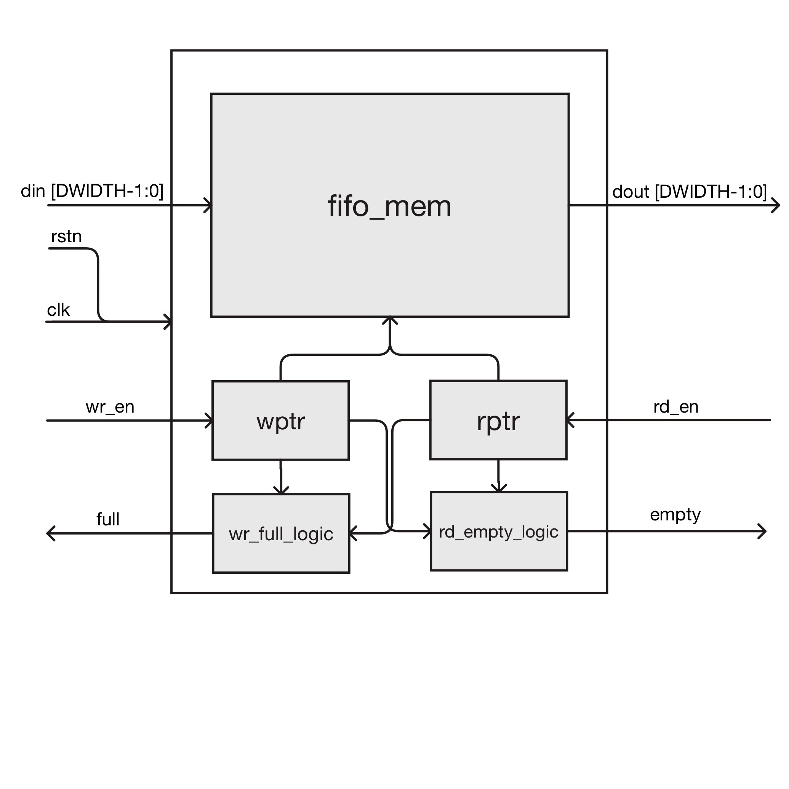
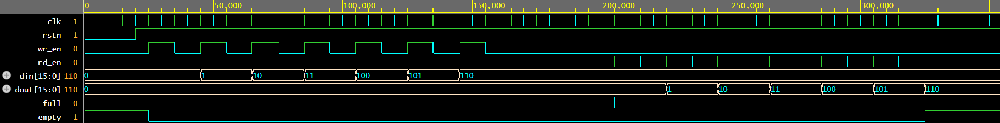
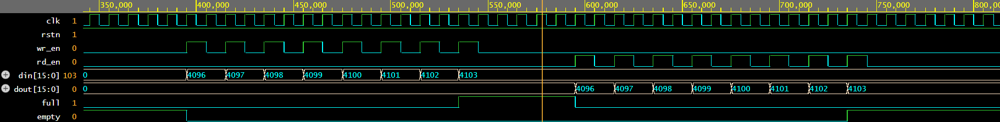

Parameterized Synchronous FIFO Design in Verilog

1. Introduction

What is a FIFO?

FIFO stands for First-In, First-Out. It is a memory buffer element used to store data temporarily between two processes, ensuring that the first data item written into the buffer is the first data item read out.

FIFOs are fundamental building blocks in digital systems, used for buffering data between modules that may operate at different speeds or have variable data rates.

Synchronous FIFO

This project implements a Synchronous FIFO, where both the read and write operations occur in the same clock domain (controlled by a single clk). This is in contrast to an Asynchronous FIFO, which manages data transfer between two different clock domains.

Key Features of this Design

Fully Synchronous: One clock (clk) for both read and write logic.

Parameterized Depth & Width: Fully flexible design using Verilog parameters (DEPTH and DWIDTH).

Non-Power-of-Two Depth Support: The core logic is designed to correctly handle any arbitrary DEPTH, not just powers of two (e.g., it works for DEPTH=8 and DEPTH=9). This is achieved through explicit pointer wraparound logic.

"One-Slot-Empty" Convention: Uses an efficient and robust method to distinguish between full and empty states, where the FIFO is considered "full" when DEPTH-1 items have been written.

2. FIFO Architecture

The FIFO is designed as a single, self-contained module (sync_fifo.v). Its architecture consists of four primary components:

Internal Memory: A register array (fifo_mem) that stores the data.

Write Pointer (wptr): An address pointer that indicates the next location to be written.

Read Pointer (rptr): An address pointer that indicates the current location to be read.

Status Flag Logic: Combinational logic that generates the full and empty signals based on the pointers.

High-Level Block Diagram

(This diagram shows the module's interface)

3. Design Details: Pointer and Flag Logic

The most critical part of this design is the pointer logic that supports non-power-of-two depths.

Pointer Wraparound Logic

Instead of relying on natural binary overflow (which only works for power-of-two depths), the pointers check their position against the DEPTH parameter explicitly.

// If pointer is at the last address (DEPTH-1), wrap to 0. Otherwise, increment.
assign wptr_next = (wptr == DEPTH - 1) ? {ADDR_WIDTH{1'b0}} : wptr + 1'b1;
assign rptr_next = (rptr == DEPTH - 1) ? {ADDR_WIDTH{1'b0}} : rptr + 1'b1;

This ensures that for a DEPTH=9, the pointers correctly wrap from address 8 back to 0, rather than continuing to 9.

Empty and Full Conditions

The status flags are generated combinationally based on the pointer values:

Empty: The FIFO is empty when the read and write pointers are at the same location.

assign empty = (wptr == rptr);

Full: The FIFO is full when the next write pointer (wptr_next) would collide with the current read pointer.

assign full = (wptr_next == rptr);

4. Simulation Results

The design was verified using a Verilog testbench (fifo_tb.v) that instantiates two separate FIFOs to test both scenarios:

Test A: A standard power-of-two depth (DEPTH=8).

Test B: A non-power-of-two depth (DEPTH=9).

The testbench performs a "fill-then-empty" sequence on both instances.

Test A: Waveform (DEPTH = 8)

This waveform shows Test A (power-of-two) filling with 7 items (as expected for DEPTH=8 with one-slot-empty) until the full_a signal goes high. It is then read until empty_a goes high. The data (dout_a) matches the input (din_a).

Test B: Waveform (DEPTH = 9)

This waveform is the critical proof of the design. It shows Test B (non-power-of-two) filling with 8 items (as expected for DEPTH=9 with one-slot-empty) until full_b goes high.

Crucially, the read-back phase shows all 8 items (0x1000 to 0x1007) are read out correctly, proving the pointer logic is sound and no data is lost or corrupted.

5. RTL / Logic Synthesis View

The following diagram is a conceptual RTL (Register-Transfer Level) schematic of the sync_fifo module. It shows the main logical components: the memory block (fifo_mem), the pointer registers (wptr, rptr), and the comparators (==) that generate the status flags.

(This is the same as the block diagram, which is common for high-level views)

6. File Descriptions

verilog/sync_fifo.v: The main, parameterized, non-power-of-two-safe Synchronous FIFO design file.

verilog/fifo_tb.v: The Verilog testbench used to verify the design for both DEPTH=8 and DEPTH=9.

verilog/fifo_top.v: A simple top-level wrapper, useful for synthesis.

verilog/fifo_memory.v: A basic dual-port memory block.

verilog/wptr_full.v: Reference module for write-pointer/full-logic (power-of-two only).

verilog/rptr_empty.v: Reference module for read-pointer/empty-logic (power-of-two only).

7. Tools Used

Language: Verilog (IEEE 1364-2005)

Simulation: Cadence Xcelium (run on EDA Playground)

Waveform Viewing: GTKWave

Diagrams: Mermaid.live